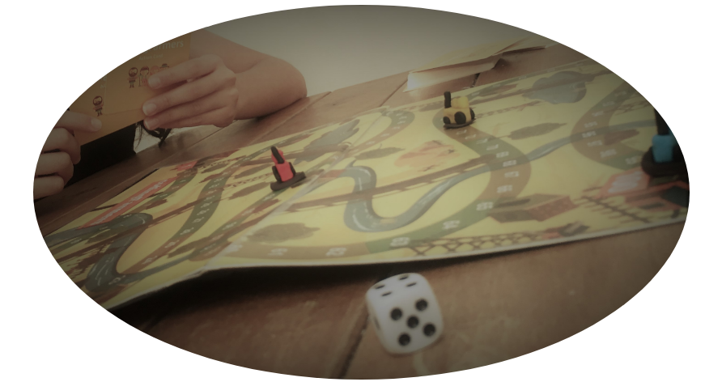

## 🧩 → 👩‍💻 | Project APB
#### "Algorithms and Programming for Beginners: Preparing New Talents in the Language of Computing Technologies".
 

                                                             
  

  
 
<section>

  
This project was planned, proposed, and carried by me and two undergrad students working under my supervision. The project aimed at Brazilian high-school level students that wished to learn how to program. The project focused on developing their algorithmic thinking - rather than just learning a programming language in the traditional way.

  

The project encompassed playful activities such as handcrafting bracelets with the student's initials in binary ASCII representation, cardboard games, problem-solving challenges, team challenges mixed with programming, and even the coding of a time-capsule, where the students hard-coded messages with their own forecasts to the next 10 years.

  

The participation of the interns under my supervision was invaluable to the project's success. They helped me in different activities such as crafting the games and prizes; helping me organize and coordinate the in-class and outdoor activities with the students; helping the students with coding questions etc.

  

The project also stimulated the application and participation of women and the LGBTQIA+ audience to promote their inclusion and empowerment in the Brazilian tech field.

  

<strong>You can check the videoclip that we made with the students here: https://youtu.be/xv5OHSXO71w </strong>

</section>
