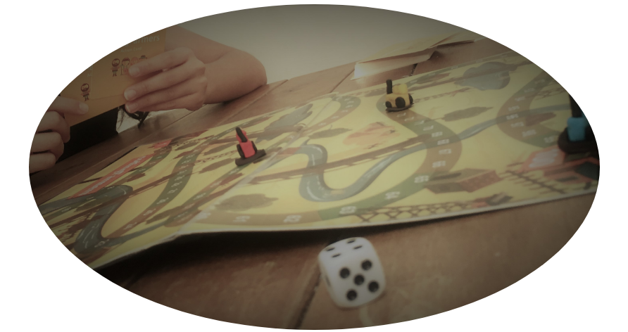

## 🧩 → 👩‍💻 | Project APB
#### "Algorithms and Programming for Beginners: Preparing New Talents in the Language of Computing Technologies".
 

                                                             
  

  
 
<section>

  
The project aimed at Brazilian high-school-level students who wished to learn code. The project focused on developing their algorithmic thinking - rather than just learning a programming language in the traditional way.

  

The project encompassed playful activities such as handcrafting bracelets with the student's initials in binary ASCII representation, cardboard games, problem-solving challenges, team challenges mixed with programming -- and even the coding of a time-capsule, where the students hard-coded messages with their forecasts to the next ten years.

  
 

The project also encouraged teenagers from underrepresented communities to apply and participate, promoting their inclusion and empowerment in Brazil’s tech sector.

  

<strong>You can check the project's public release website here:
http://www.ifgoias.edu.br/component/content/article/17-ifg/ultimas-noticias/13761-inscricoes-abertas-curso-algoritmos-2 (click the British flag in the top-bar to translate to English)
</strong>

<strong>You can check the video announcing the project here: (English subtitles available in the video settings)
video: https://youtu.be/MxRg-xy3myQ 
</strong>

<strong>You can check the videoclip that we made with the students here: https://youtu.be/xv5OHSXO71w </strong>

</section>
